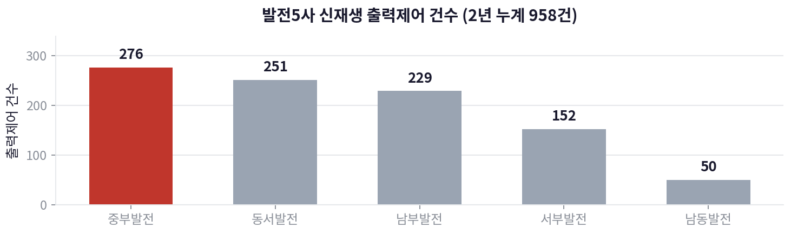
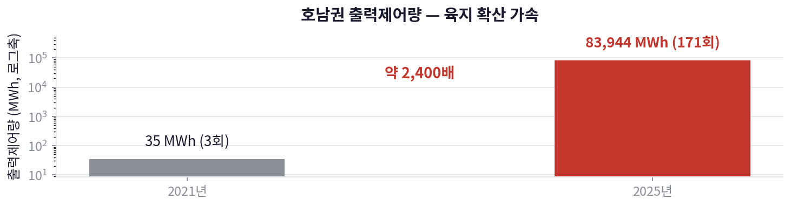
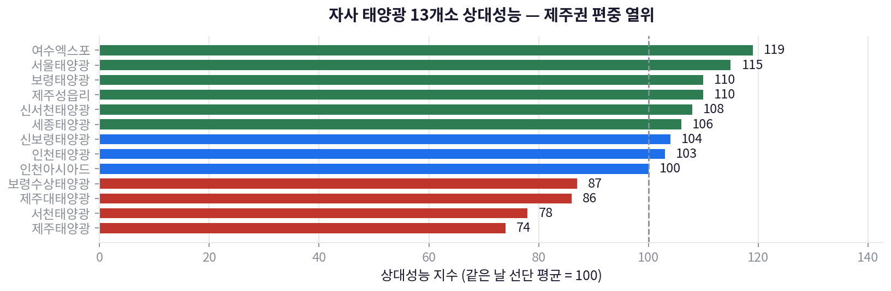
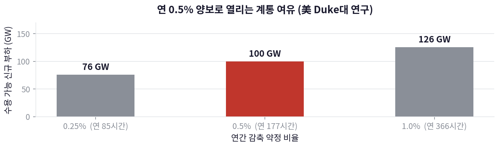

# 버려지는 재생에너지를 AI 학습 부하로 흡수하기

공공데이터로 발전사의 출력제어 손실을 검증하고, 그 손실을 수익 자원으로 바꾸는
운영 모델을 설계한 개인 분석 프로젝트입니다.

| | |
|---|---|
| 기간 | 2026.07 – 2026.08 |
| 데이터 | 공공데이터포털 발전량 데이터, 국정감사 제출자료, 전력거래소 출력제어 실적 |
| 도구 | Python, pandas, matplotlib |
| 산출물 | 분석 코드 · 그림 4종 · 정책 제안서 (한국중부발전 아이디어 공모 제출) |

---

## 문제인식 — 남는 전기를 버리고 있다

재생에너지가 계통이 감당할 수 있는 양보다 많이 생산되면 발전을 강제로 멈춘다.
이것이 출력제어이고, 멈춘 만큼은 그대로 손실이다.

한국중부발전이 2024년 국정감사에 직접 제출한 자료에 따르면, 발전 5사 2년 누계 958건 중
**중부발전이 276건으로 최다**였고 자체 추산 손실은 **연 3.63억원**이었다.
회사가 스스로 인정한 숫자라 논쟁의 여지가 없는 출발점이었다.



더 중요한 것은 방향이다. 출력제어는 제주만의 문제로 알려져 있었지만,
호남권은 2021년 35 MWh(3회)에서 2025년 83,944 MWh(171회)로 **약 2,400배** 늘었다.
육지로 번지고 있고, 지금 손실 규모는 앞으로의 하한선이다.



## 검증 — 날씨 탓인지 설비 탓인지 가른다

발전량이 낮은 발전소를 찾는 것은 쉽다. 그게 날씨 때문인지 설비 때문인지 가르는 것이 어렵다.
절대 발전량을 비교하면 설비용량과 그날의 일사량이 뒤섞여 아무 결론도 못 낸다.

그래서 **같은 날 선단 전체의 이용률 평균을 100으로 놓고** 각 발전소를 지수화했다.
같은 날로 정규화하면 전국적 기상 변동과 계통 전체 출력제어가 상쇄되고,
발전소 고유의 성능 차이만 남는다. 결측일과 정기점검이 평균을 왜곡하지 않도록
일 단위 지수의 중앙값을 최종값으로 썼다.

```
이용률(i, d)   = 발전량(i, d) / 설비용량(i) / 24
상대성능(i, d) = 이용률(i, d) / mean_j( 이용률(j, d) ) × 100
상대성능(i)    = median_d( 상대성능(i, d) )
```



제주권 설비가 74~87로 뚜렷하게 열위였다. 그리고 결정적으로,
**어떤 발전소가 0을 기록한 날에 같은 지역의 다른 발전소는 정상 가동 중이었다.**
기상 요인과 계통 출력제어는 이 시점에서 배제됐고, 남는 것은 설비 고유 요인뿐이었다.

이 정규화가 실제로 기상 요인을 상쇄하는지는 합성 데이터로 검증했다
(`tests/test_relative_performance.py`). 날씨 계수를 0.2~1.0으로 요동치게 만들고
발전소별 실력만 1.2 / 1.0 / 0.8로 고정했을 때, 지수는 정확히 120 / 100 / 80을 복원한다.

## 해법 — 저장이 아니라 수요를 만든다

기존 대응은 ESS·수소처럼 **남는 전기를 저장**하는 쪽에 몰려 있었다.
저장은 비싸고, 저장한 뒤에도 팔 곳이 필요하다.
비어 있는 접근은 **그 시간에 쓸 수요를 만드는 것**이었다.

AI 모델 학습은 이 조건에 거의 완벽하게 맞는 부하다. 실시간 응답이 필요 없고,
몇 시간 미뤄도 결과가 같으며, 전력이 원가의 큰 부분을 차지한다.
핵심은 **추론이 아니라 학습만** 대상으로 삼는 것이다. 추론은 지연을 허용하지 않는다.

이 방향이 성립하려면 "부하를 늘리면 계통이 더 힘들어지지 않나"에 답해야 한다.
Duke University Nicholas Institute의 2025년 연구가 그 답을 준다.
신규 부하가 **연간 0.5%(약 177시간)만 감축에 동의**하면 미국 계통은
기존 설비만으로 100 GW를 추가 수용할 수 있다. 1년에 며칠만 양보하면
접속 대기열을 건너뛸 만한 여유가 열린다는 뜻이다.



> 미국 계통 기준 연구이므로 국내에 그대로 적용되지 않는다.
> 제안서에서도 방향의 근거로만 인용하고 국내 수치는 별도로 산정했다.

## 효과

출력제어로 버려지던 전력이 연산 매출로 바뀌고, 유휴 부지가 수익을 내며,
감축 약정을 대가로 계통 접속 대기 기간이 단축된다.
연 3.6억원의 확정 손실이 회수 대상이 된다.

무엇보다 이 구조는 **공급과 수요를 한 사업자가 동시에 설계할 수 있을 때만** 성립한다.
선행 사례들(남부발전 삼척 데이터센터 MOU, 한전 폐지석탄부지 클러스터)은 모두
**입지 결합**까지만 갔고 **운영 결합**은 공백이었다. 그 공백이 이 제안의 자리다.

---

## 재현 방법

```bash
pip install -r requirements.txt
python src/figures.py                        # data/ 의 CSV로 그림 4종 재생성
python tests/test_relative_performance.py    # 상대성능 지수 검증
```

원시 발전량 데이터는 용량과 재배포 조건 때문에 포함하지 않았습니다.
공공데이터포털에서 내려받는 절차와 각 수치의 출처는 [`data/README.md`](data/README.md)에
정리해 두었습니다.

## 구성

```
data/      분석에 사용한 집계 데이터 + 출처·산출 방법
src/       상대성능 지수 계산, 그림 재생성
tests/     합성 데이터로 정규화 로직 검증
figures/   결과 그림 4종
tools/     부록: 의존성 없는 HWP 5.0 리더·에디터 (별도 README)
```

`tools/hwp5`는 이 프로젝트에서 파생된 부산물입니다.
관공서 서식이 HWP인데 `olefile`조차 설치할 수 없는 환경이라,
CFB 컨테이너 파싱부터 HWP 레코드 구조까지 표준 라이브러리만으로 직접 구현했습니다.
같은 문제를 겪는 분에게는 이쪽이 더 쓸모 있을 수 있습니다.

## 알림

제안서 원문과 공모 서식은 저작권이 주최 측에 귀속되어 이 저장소에 포함하지 않았습니다.
여기에 담긴 것은 직접 작성한 분석 코드, 공개 자료에서 수집한 집계 데이터,
그리고 그로부터 생성한 그림입니다.

## 라이선스

코드는 MIT. 데이터는 각 파일에 표기된 원출처의 이용 조건을 따릅니다.
